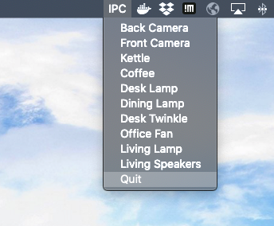

# Simple Mac manubar item with quick access to my security cameras and smart switch toggles.

Dependencies for the cameras:
- python
- rumps
- OpenCV

see the simple script view_ipcam.py to set up.

Dependencies for the switch toggles:
- tuyapi by [codetheweb](https://github.com/codetheweb/tuyapi)
